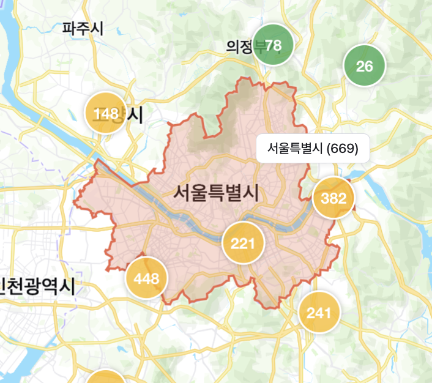
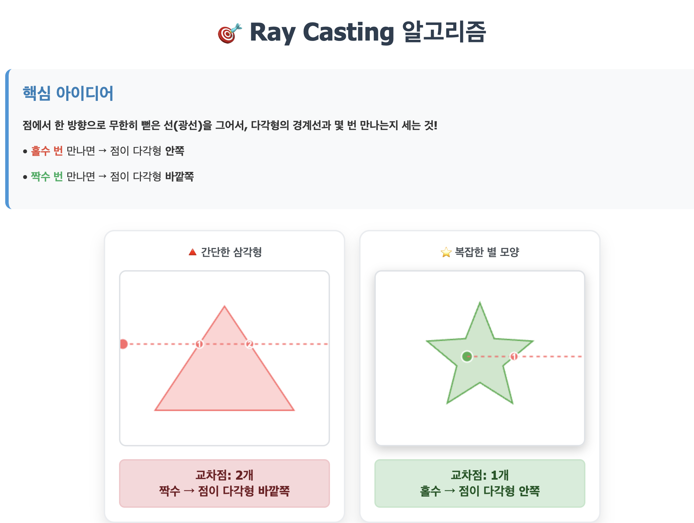
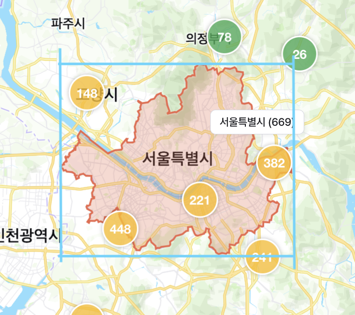
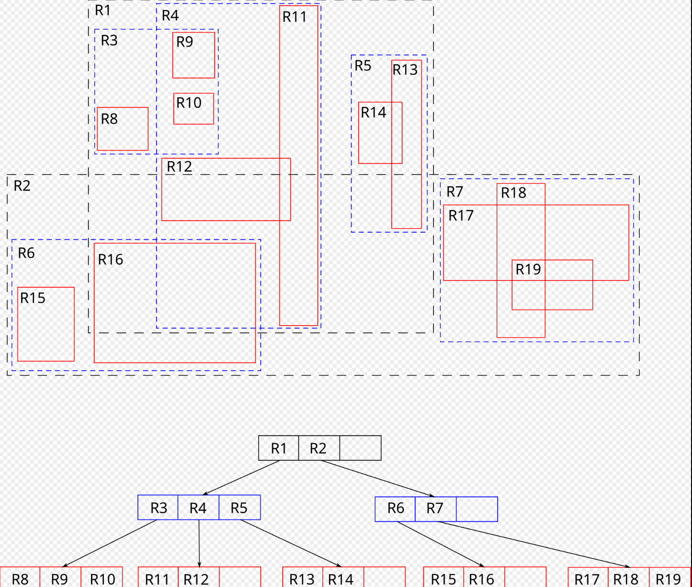

## 문제발견: 느린 point-in-polygon 검사

1. 문제발견: 느린 point-in-polygon 검사!



위와 같이 각 지역 권역 폴리곤 내부에 포함되는 마커의 개수를 출력하는 기능이 있다.

위 상태를 예롤 들자면 서울에 669개의 마커가 있다는 뜻이다. 지역에 마우스를 hover 할 때마다 계산이 되는데, 지역을 옮겨다닐때마다 스택이 blocking 되어서 반응성이 매우 떨어지고 있었다! 처음에는 마우스를 hover 할 때마다 변경되는 district 데이터가 변경됨에 따라 테이블 같은 dom이 많은 곳에 리랜더링이 발생하는지 의심했지만, 리랜더링은 꽤 잘 최적화되어 있었다.

문제는 전국 마커 중에 서울에 포함되는 마커 개수 계산 함수가 스택을 꽉 막아버린 것이었다.

## Ray-Casting 알고리즘 간단한 이해

2. Ray-Casting알고리즘 간단한 이해

기존코드를 보면

```typescript
const count = () => {
  return allJobs.filter(job => 
    booleanPointInPolygon(point([job.longitude, job.latitude]), polygon)).length;
}
```

만약 allJobs가 10,000개라면 10,000개의 데이터에 대해 booleanPointInPolygon 계산이 실행된다.

booleanPointInPolygon함수는 Ray-Casting 알고리즘을 사용하는 계산함수로써 다각형의 변의 개수에 따라 O(n)의 성능을 가진다.

예를 들어 서울지역의 변의 개수는 3,447개이다. 그리고 10,000개의 데이터에 booleanPointInPolygon함수를 실행하면

3,447 * 10,000의 계산이 실행되어 총 34,470,000번의 계산을 실행한다. 즉, 마우스가 권역을 옮겨 다닐 때마다 34,470,000번의 연산이 실행되는 것이다.

그럼 적어도 Ray-Casting이란 게 뭔지 이해를 해야 한다.



한 점이 다각형 내부에 포함되는지 판단하는 방법은 점에서 한 방향으로 무한한 광선을 쏘았을 때 다각형 변을 지나치는 횟수가 짝수번이면 내부에 포함되지 않는다는 뜻이고, 홀수번이면 내부에 포함된다는 뜻이다.

의사코드로 나타내보자면

```typescript
let intersectionCount = 0;
for (각 변 of 다각형의 모든 경계선){
    if(이 변이 경계선과 교차한다면){
        intersectionCount++;
    }
}
```

위와 같이 나타낼 수 있다. 그리고 모든 경계선을 순회하면서 광선이 교차했는지 검사하면 된다.  
어떻게 광선이 변과 교차했는지 검사할까? 교차점 X를 구하는 방법은 선형보간법 이란 것을 사용한다.

동영상 서비스가 종료되어 해당 콘텐츠를 재생할 수 없습니다.

이것도 간단히 설명을 하자면

"Y가 절반지점에 있으면 X도 절반지점에 있을 것이다"라는 논리다.  
일단 변을 이루는 두 점의 비례관계를 구한다. 내가 원하는 포인트를 P라고 하면 P의 Y위치 진행률은

(P.y - A.y) / (B.y - A.y)

라고 할 수 있다. 즉, 전체 변의 Y 높이 중 P는 이 정도 진행이 되었다.라고 이해할 수 있다.

그럼 위에서 구한 진행률을 이용해서 P의 X방향으로 이동거리를 구할 수 있다.

진행률 * (B.x - A.x)  
예를 들어 진행률이 y 쪽으로 0.5(50%)라고 하면  
전체 x 값, 즉, 위 동영상에서 보자면 450 - 150 = 300이니까 300 중에 0.5 만큼인 150만큼 이동했을 것("Y가 절반지점에 있으면 X도 절반지점에 있을 것이다")이라는 뜻이다.

이렇게 진행률과 P의 x방향 이동거리를 구하고 나면 교차점 x를 구할 수 있다.

시작점인 A.x에 이동거리를 더해주면 된다.

위 내용을 의사코드로 나타내자면

```typescript
function 광선이_변과_교차했나(점P, 변AB){
  if(A.y === B.y) return false;
  if(P.y < min(A.y, B.y) || P.y > max(A.y, B.y)) return false;
  교차점X = A.x + (P.y - A.y) * (B.x - A.x) / (B.y - A.y);
  return 교차점X > P.x; 
}
```

교차점X가 광선을 쏜 광원의 x값보다 크면 교차했다고 판단한다.(이 알고리즘에서는 광선을 오른쪽으로 쐈다고 볼 수 있음)

정리하자면 서울을 표현하는 다각형은 변의 개수가 3,447개이고 이 모든 변을 순회하며 광선이_변과_교차했나() 함수를 호출하여 다각형 내 점 포함 여부를 체크하는 것이다.

## 성능 병목 분석

3. 성능 병목 분석

위에서 봤듯이 변이 많은 다각형, 즉 권역을 나타내는 다각형을 대상으로 booleanPointInPolygon을 호출하면 O(n)으로 알고리즘이 동작하므로 무거운 작업이 된다. 모든 지역에 hover를 할 때마다 10,000개의 allJobs배열을 순회하며 Ray-Casting알고리즘을 사용한 booleanPointInPolygon을 호출했기 때문에 스택 블로킹이 생겼다.

## 최적화 전략 수립

4. 최적화 전략 수립

원인을 알았으니 어떤 부분에서 최적화를 할 수 있을지 전략을 수립하면 된다.  
booleanPointInPolygon을 호출하지 않는 방법은 없다. 다각형 내부에 포함되었는지를 판단하려면 booleanPointInPolygon을 사용해야 한다. 다만 누가 봐도 부산에 있는 job을 서울 권역내부에 있는지 돌릴 필요는 없다. 누가 봐도 광주에 있는 job인데, booleanPointInPolygon을 굳이 돌릴 필요가 없다.

서울 권역에 포함된 점을 골라내고 싶다면 서울에 포함될 가능성이 있는 점들을 먼저 골라내고, 그 후보들을 대상으로 booleanPointInPolygon을 실행하면 된다. 포인트는 booleanPointInPolygon의 호출을 최대한 줄이는 것이다.



서울을 예로 들면 서울에 포함될 가능성이 있는 job을 선별하기 위해 다각형의 최대, 최소 x, y값으로 직사각형을 그려서 내부에 포함된 job을 먼저 선별하고 그 일부를 후보로 만들 수 있으면 계산 대상이 줄어들 것이다.

다각형의 minX, minY, maxX, maxY 값을 얻는 것은 쉽다. 그럼 이 minX, minY, maxX, maxY를 구해서 그 후보를 어떻게 추릴 수 있을까? 현재 allJobs의 자료구조는 단순한 배열이다. 공간 데이터를 가지고 값을 쉽게 탐색할 수 있는 자료구조가 필요하다.

그 해답은 R-Tree라는 자료구조를 사용하면 된다.

## 공간인덱싱 R-tree 간단한 이해

5. 공간인덱싱 R-tree 간단한 이해

R-Tree는 지리적 좌표 같은 다차원 정보를 인덱싱 하는 트리라고 한다.  
뭔소리냐하면 2,4,5,8,12를 이진탐색트리로 만든다고 하면 node들의 대소비교가 간단하다. 2보단 4가 크고, 4보단 5가 크다.  
근데 지리적 좌표를 대상으로 한다면 (1,5)와 (3,2) 중에 누가 더 크다고 할 수 있는가?  
R-tree가 바로 이런 데이터를 알고리즘을 활용해서 "가까운 점끼리 묶는"인덱싱을 한다.  
무엇을 가깝다고 판단하는가? => 이것은 다양한 알고리즘이 있는 것 같다. 개념을 이해하자면



위 이미지가 가장 쉬운 것 같다.  
가깝게 위치한 점들을 묶어서 가장 작은 직사각형 MBR(Minimun Bounding Rectangle)부터 만들고 이것이 리프노드가 된다.  
위 그림에서 보면 R8, R9같이 빨간색 직사각형이 리프노트 MBR이라고 볼 수 있다. 그리고 또 근처에 있는 리프노드들을 묶어서 그보다 근 MBR을 만들고 이것이 부모노드가 된다. 이것을 반복하면서 트리를 형성하고 모든 노드를 포함하는 루트노드가 생기면 R-tree가 된다.  
이 MBR이 공간데이터를 기반으로 인덱싱을 하는 핵심이다.  
search 메서드를 예로 들면 이해에 도움이 된다.

```typescript
search(searchArea: Rectangle): DataObject[] {
    const results: DataObject[] = [];

    for (const entry of this.entries) {
      // MBR 겹침 검사
      if (this.overlaps(entry.mbr, searchArea)) {
        if (this.isLeaf) {
          // 리프 노드: 실제 데이터 반환
          if (entry.dataObject) {
            results.push(entry.dataObject);
          }
        } else {
          // 내부 노드: 재귀 탐색
          if (entry.childNode) {
            results.push(...entry.childNode.search(searchArea));
          }
        }
      }
      // 겹치지 않으면 해당 엔트리는 건너뜀 (가지치기!)
    }

    return results;
  }
```

트리에서 search 구현부를 간단히 보면 this.entries가 현재 탐색하고자 하는 노드의 대상이라고 생각한다.

모든 대상을 순회하면서 해당 노드의 MBR이 탐색하고자 하는 MBR을 모두 포함하는지(this.overlaps) 검사한다.  
만약 포함하지 않는다면 아무것도 안 한다. 탐색하지 않는다.  
만약 포함한다면(엄청 포괄적인 노드인 상위 노드부터 해당될 것이다) 그 노드가 리프노드인지 확인한다.

만약 MBR을 포함하는 리프노드이면 그 리프노드의 데이터를 모두 결과로 반환한다. 찾고자 하는 가장 작은 직사각형의 대상이다.  
만약 MBR을 포함하지만 리프노드가 아니라면 더 후보를 줄일 수 있는지 찾아봐야 하므로 해당 노드의 자식노드에 search를 반복한다.

```typescript
 private overlaps(rect1: Rectangle, rect2: Rectangle): boolean {
    return !(rect1.maxX < rect2.minX || rect1.minX > rect2.maxX ||
             rect1.maxY < rect2.minY || rect1.minY > rect2.maxY);
  }
```

포함하는지 판단하는데 mbr이 사용된다.  
쉽게 판단하기 힘든 공간을 MBR이라는 개념을 통해 인덱싱을 하는 트리인 R-tree는 대용량 공간데이터를 다루는데 큰 도움이 된다.

## 실제 구현

6. 실제 구현

```typescript
const getDistrictCount = () => {
  const [minX, minY, maxX, maxY] = bbox(polygon);
  
  const potentialJobs = RtreeJobs.search({minX, minY, maxX, maxY});
  
  const count = potentialJobs.filter(job => 
    booleanPointInPolygon(point([job.longitude, job.latitude]), polygon)).length;
    
  return count;
}
```

공간 데이터를 R-tree로 변환하는 작업은 직접 하지 않았다. 다양한 라이브러리가 있는데, 나는 성능비교를 통해 RBush 라이브러리를 사용했다. RBush를 사용해서 allJobs를 RtreeJobs로 변환했다. 자료구조만 변경된다.  
RBush라는 생성자를 통해 만들어진 Rtree인스턴스는 search 메서드가 구현되어 있다. 여기에 bbox로 구한(다른 방법으로 구해도 되지만 나는 react-map-gl을 사용하므로) minX, minY, maxX, maxY를 search에 넣어준다.  
이것을 potentialJobs라고 이름 지은 이유는 해당 polygon에 포함될 가능성이 있는 대상이기 때문이다.  
potentialJobs는 이제 10,000개가 아니라 R-tree에서 공간인덱싱으로 한번 탐색을 마친 데이터가 되므로 일부분이 된다.  
이것을 대상으로 booleanPointInPolygon을 호출한다.

## 성능 비교

7. 성능 비교

최종성능 비교를 해보니 경기도처럼 데이터가 모여있는 경우 호버 할 때 1300ms의 블로킹이 걸린다.  
단순한 호버이벤트에 이 정도의 블로킹이라면 사용자는 엄청나게 저하된 성능의 화면을 보게 된다. 참아줄 수가 없다.  
위 코드에서 RtreeJobs.search부분은 무려 평균 0.08ms라는 엄청 빠른 속도로 실행됐다.  
그리고 경기도 데이터를 대상으로 booleanPointInPolygon 부분 실행속도는 filter가 완료되는데 120ms정도가 걸렸다. 후보 자체가 적은 강원도나 다른 지방 데이터는 훨씬 빠른 개선을 보였다. 왜냐하면 기존에는 강원도도 10,000개를 대상으로 booleanPointInPolygon을 했으니 대상 군이 적을수록 개선이 커진다.  
하지만 가장 대상이 많은 경기도를 기준으로 해도 약 10배 정도의 성능개선이 되었다. 하지만 여전히 120ms는 호버이벤트에 딜레이처럼 느껴졌고, 나머지는 캐싱을 해서 해결했다.
