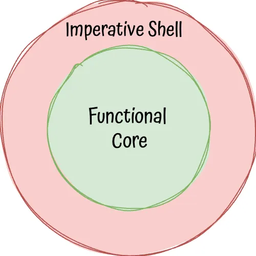
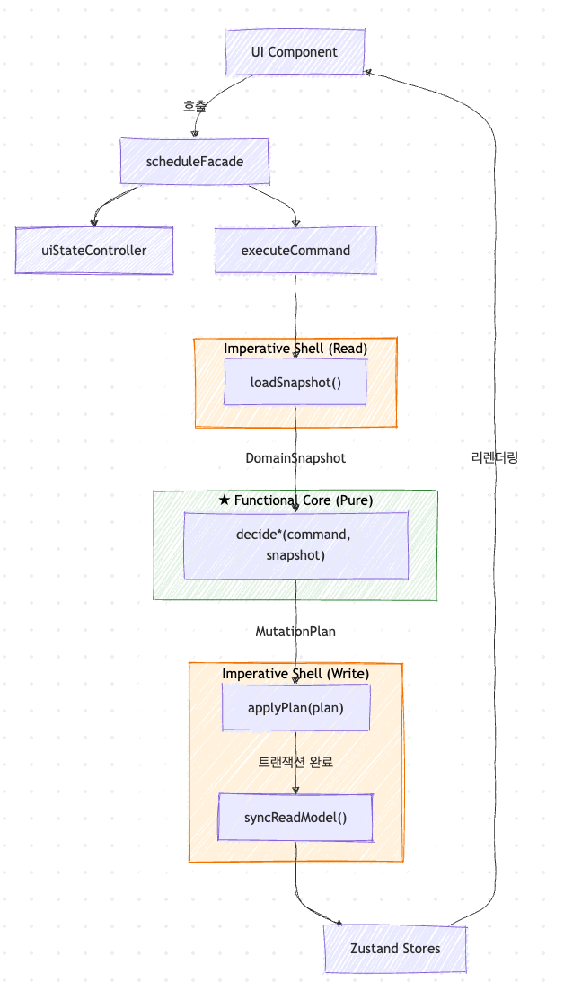

클라이언트에서 왜 DB를 사용했을까요?

총 세번의 리팩토링을 거쳤고, 각 단계마다 실패를 경험했습니다.

간단하게 기능을 설명드리자면 5개의 엔티티가 매우 자유도 높게 생성, 편집되는 기능을 구현했습니다.

상태를 클라이언트 측에서 오랜 기간 끌고가며 편집해야 했습니다.

## 각 상태를 정규화하고 key를 기반으로 참조

**첫번째 구현**

"엔티티도 많고 관계도 복잡하기 때문에 각 상태를 정규화하고 key를 기반으로 참조하도록 작성하자"

복잡한 상태간의 관계가 핵심입니다. 만약 객체간의 관계를 중첩으로 표현하면 깊은 객체의 약간의 수정에도 코드가 굉장히 많아집니다.

게다가 리랜더링 촉발을 위해 불변성을 유지하기 위해 중첩된 Copy on Write, 의도하지 않은 참조까지 생각하다보면 분명히 에러가 발생할겁니다. 첫번째 구현에서는 다행이 이런 상황을 예상하고 정규화된 객체로 5가지 상태를 만들었습니다.

**첫번째 구현의 문제점**

정류장 마커의 삭제 버튼 클릭 핸들러에 모든 스토어를 다 끌어와야한다.


마커 컴포넌트의 삭제 버튼 핸들러만 300줄이 되었습니다.

상단에서 설명했듯이, 객체간 관계가 매우 복잡합니다. 특히 정류장 이라는 객체는 관계의 출발점이 되는 객체입니다.

그렇다보니 정류장을 삭제하면 그와 연관관계에 있는 객체들을 어떻게 처리해줄지 전부 판단해야 했습니다.

자연스럽게 컴포넌트에서 모든 스토어를 참조하게 되고, 컴포넌트 내부와 zustand setter에 비즈니스 로직이 부분별하게 섞이게 됩니다.

아래 코드에서 간단히 표현했습니다.

```typescript
function StationMarker({ stationId }: { stationId: string }) {
    const removeStation = useStationStore((s) => s.removeStation);                                   const routeStations = useRouteStationStore((s) => s.routeStations);
    const removeRouteStation = useRouteStationStore((s) => s.removeRouteStation);                    const routes = useRouteStore((s) => s.routes);
    const removeRoute = useRouteStore((s) => s.removeRoute);                                         const assignments = useAssignmentStore((s) => s.assignments);
    const removeAssignment = useAssignmentStore((s) => s.removeAssignment);
    const updateAssignment = useAssignmentStore((s) => s.updateAssignment);
    const students = useStudentStore((s) => s.students);
    const updateStudent = useStudentStore((s) => s.updateStudent);

    const handleDelete = () => {
      // 1) 이 정류장을 사용하는 노선정류장 찾기
      const affectedRS = routeStations.filter(
        ...
      );

      // 2) 영향받는 학생배차 처리
      for (const rs of affectedRS) {
        const boardingAssignments = assignments.filter(...);
        // 승차 정류장이 삭제되면 → 배차 자체를 삭제
        for (const assignment of boardingAssignments) {
          ...
          // 기본 정류장 되돌리기
          ...
        }

        const dropOffAssignments = assignments.filter(...);
        // 하차 정류장이 삭제되면 → 하차만 null로
        for (const assignment of dropOffAssignments) {
          ...
        }
      }

      // 3) 노선정류장 삭제
      for (const rs of affectedRS) {
        ...
      }

      // 4) 남은 정류장이 2개 미만인 노선 → 노선 자체 삭제
      const affectedRouteIds = ...;
      for (const routeId of affectedRouteIds) {
        const remaining = routeStations.filter(...);
        if (remaining.length < 2) {
          // 노선 삭제 전에 남은 노선정류장의 배차도 처리...
          for (const rs of remaining) {
            const orphanedAssignments = assignments.filter(...);
            for (const assignment of orphanedAssignments) {
              // 배정 삭제
              ...
              // 학생 정보 업데이트
              ...
            }
            // 노선정류장 삭제
            ...
          }
          // 노선 삭제
          ...
        }
      }

      // 5) 마지막으로 정류장 삭제
      removeStation(stationId);
    };

    return (
      <Marker>
        <button onClick={handleDelete}>×</button>
      </Marker>
    );
  }
```

정류장을 삭제하기 위해 관계부터 정리하는데, [노선정류장]이라는 객체를 찾아서 [배차]객체를 먼저 삭제하고, [하차정류장]도 처리해주고, [노선]의 남은 정류장 갯수도 처리하고... 아무리 들여다봐도 왜 이렇게 했는지 알 수 없고, 담당자가 바뀌면 에러 발생시키기 딱 좋습니다.

ui 컴포넌트와 zustand setter에 이런 코드가 펼쳐져 있다고 보면 됩니다.

**첫번째 깨달음**

비즈니스 로직과 ui 와 상태 관리가 분리되어야 한다. ui 컴포넌트와 상태 스토어는 비즈니스 로직을 모르게 하자.

## 레이어를 분리하자, zustand는 crud만

**두번째 구현**

"레이어를 분리하자. zustand를 source of truth로 두고 crud만 담당하자. 비즈니스 로직은 facade라는 계층을 두고 조립하자."

두번째 구현에서는 첫번째 실패에서 교훈을 얻어 관심사를 분리하기 위해 비즈니스 로직을 담당하는 레이어를 추가로 만들고 이름을 facade라고 지었습니다.

zustand는 각 객체를 생성, 수정, 삭제 하는 메서드만 두고 비즈니스 로직이 섞이지 않게 했습니다.

facade에서는 각 스토어의 메서드를 참조하여 비즈니스 로직을 조립했습니다.

ui는 facade가 조립해준 메서드만 호출하여 사용했습니다.

이렇게 관심사를 분리했더니 스토어는 가벼웠고, ui 컴포넌트는 깔끔해졌습니다.

**두번째 구현의 문제점**

1. 복잡한 비즈니스 로직의 관계를 코딩으로 직접 정리함. 정합성 보장이 나의 손에만 달려 있는 상태. 실수하면 고아데이터 발생.

2. 비즈니스 로직에는 클라이언트 상태 업데이트와 api콜이 조합되어있음. 업데이트 중 에러가 발생하면 일부 상태만 업데이트 되어 원자성에 문제가 생김.

아래 코드를 예제로 설명합니다.

```typescript
class ScheduleFacade {
    async removeStation(stationId: string) {
      const affectedRS = useRouteStationStore
        .getState()
        .routeStations.filter(...);

      const affectedRouteIds = [
        ...new Set(affectedRS.map((rs) => rs.routeId)),
      ];

      // 1) 배차 정리
      for (const rs of affectedRS) {
        ...
      }

      // 2) 노선정류장 삭제
      for (const rs of affectedRS) {
        ...
      }

      // 3) 노선 최소 정류장 검사 → 노선 삭제
      for (const routeId of affectedRouteIds) {
        ...
        if (remaining.length < 2) {
          for (const rs of remaining) {
            ...
          }
          ...
        }
      }

      try {
        // 4) 서버 동기화 — 여기서 실패하면?
        // 🔴 클라이언트 상태는 이미 변경됨. 서버는 변경 전 상태.
        await api.deleteStation(stationId);
        
        // 5) 정류장 삭제
      	...
      } catch (error) {
        ...에러처리...  
      }
    }
  }
```

이렇게 관심사를 나눴지만 복잡한 관계를 직접 코딩하느라 간단한 정류장 삭제조차 버그가 발생할 여지가 많았습니다.

더군다나 뒤늦게 api콜이 추가되면서 상태간의 원자성에도 문제가 생겼습니다. 정류장이 삭제될줄 알고 관계부터 정리했는데, 정작 api에러가 발생해서 정류장은 그대로 남아있는 케이스가 발생할 수 있습니다.

**두번째 깨달음**

"내가 인간 DBMS도 아니고, 관계를 직접 해결하려는게 코드의 대부분이고, 버그의 원인이다. 이걸 직접하려고 하는 것이 욕심이다."

## 영속성 없는 인메모리 싱글톤 db

**세번재 구현**

두번째 실패를 겪으며 코드의 대부분이 관계에 집중되어 있다는 것을 알았습니다. 만약 관계형 db의 힘을 빌릴 수 있다면 정합성과 원자성을 보장하면서도 비즈니스 로직에 집중할 수 있겠다는 생각이 들었습니다.

그래서 sql.js을 사용하여 영속성 없는 인메모리 싱글톤 db를 만들었습니다.

관계 해결은 db인프라를 활용한다면, 비즈니스 로직은 어떻게 쌓아갈 수 있을까?

db가 모든 데이터 변경을 담당하는 인프라가 되었으니 정합성과 원자성은 인프라에 맞기고

비즈니스 로직은 순수함수로 작성하여 관심사를 완전히 분리했습니다.

핵심은 함수로, 변경은 얇은 레이어로.

Functional Core, Imperative Shell Architecture를 적용하여 구현했습니다.



[https://functional-architecture.org/functional_core_imperative_shell/](https://functional-architecture.org/functional_core_imperative_shell/)

### Functional Core는 순수함수로

Functional Core는 순수함수로 모든 비즈니스 로직을 작성했습니다.

```typescript
// Functional Core: DB 모름, Zustand 모름, API 모름
function decideRemoveStation(
  command: RemoveStationCommand,
  snapshot: DomainSnapshot
): DecisionResult {
  const actions: MutationAction[] = [
    { type: 'delete-station', stationId: command.stationId },
  ];

  // 비즈니스 로직: 정류장이 2개 미만이 되는 노선은 삭제
  for (const route of affectedRoutes) {
    if (remainingStationCount < 2) {
      actions.push({ type: 'delete-route', routeId: route.routeId});
    }
  }

  // 여기서는 "뭘 할지"만 반환
  return { ok: true, plan: { actions } };
}
```

매개변수 command와 snapshot을 기반으로 동일한 action을 반환하는 순수함수로 작성하고 테스트 합니다.

command와 snapshot은 Shell에서 주입됩니다.

```typescript
// Imperative Shell
const executeSupportedCommand = async (
  command: SupportedCommand,
  deps: ExecuteCommandDeps
): Promise<DecisionResult> => {
  const snapshot = await deps.loadSnapshot();        // 1. DB → 스냅샷
  const decision = decideSupportedCommand(command, snapshot); // 2.비즈니스 판단

  if (!decision.ok) return decision;                 // 에러면 여기서 끝

  await deps.applyPlan(decision.plan);               // 3. 트랜잭션으로 DB 반영
  await deps.syncReadModel?.();                      // 4. DB → ReadModel 동기화

  return decision;
};
```

모든 핸들러는 executeSupportedCommand를 통해 실행됩니다. 인프라의 역할이고, 이곳이 바로 얇은 Shell이 됩니다.

Functional Core에 접근할 수 있는 Shell은 여기가 유일합니다.

snapshot은 의존성을 주입받아 로드합니다. 여기서는 sql 싱글톤 db가 됩니다.

decide*()가 위에서 보이는 core부분입니다. 그리고 action을 반환하면 applyPlan을 통해서만 업데이트가 됩니다.

applyPlan은 DB의 트랜젝션으로 변경을 일으키는 함수입니다. 모든 변경의 원자성이 보장됩니다.

마지막 syndReadModel은 말그대로, 변경이 발생한 db의 데이터를 ReadModel과 맞춰주는 역할입니다.

db는 리액트가 감지할 수 있는 상태가 아니라 그냥 메모리에 있는 데이터일 뿐입니다.

### zustand의 역할을 ReadModel로 격하

1,2 번째 구현에서 중심적인 역할을 수행했던 zustand의 역할을 격하시켜 단순한 ReadModel로 사용합니다.

```typescript
interface Store {
  routes: RouteEntity[];
  syncDB: () => void;
  getById: (routeId: string) => RouteEntity | undefined;
}

export const useRouteStore = create<Store>((set) => ({
  routes: [],
  syncDB: () => {
    const current = RouteDAO.getAll();
    set({ routes: current });
  },
  getById: (routeId: string) => {
    const route = RouteDAO.getById(routeId);
    return route;
  },
}));
```

아주 간소해진 Zustand입니다.

편의성을 위한 getById메서드만 하나 있습니다.

모든 메서드는 유일한 데이터 원천인 DB에 접근하기 위해 DAO를 통해 이뤄집니다.

```typescript
export const RouteDAO = {
  add(route: RouteEntity): void {
    const db = scheduleDB.getDatabase();
    const stmt = db.prepare(
      `INSERT INTO routes (routeId, name, color, metrics, bus, rideManager, driver)
       VALUES (?, ?, ?, ?, ?, ?, ?)`
    );
    stmt.run(RouteDTO.toRow(route));
    stmt.free();
  },
  remove(routeId: string) {
    const db = scheduleDB.getDatabase();
    const stmt = db.prepare('DELETE FROM routes WHERE routeId = ?');
    stmt.run([routeId]);
    stmt.free();
  },
  ...
};
```

syncReadModel 메서드는 각 스토어의 syncDB를 호출하기만 하면 됩니다.

모든 상태가 최신 DB 상태로 업데이트 되고, ui는 이 ReadModel을 기반으로 랜더링됩니다.

구현한 아키텍쳐를 표현하면 아래와 같습니다.



이렇게 코드를 작성하니 관계형 db의 cascade, trigger를 충분히 활용하면서 정합성이나 참조무결성에 대해 신경쓰지 않아도 되어서

드디어 마침내!! 비즈니스 로직만 코딩할 수 있었습니다.

### db에 맡길 것과 core에서 테스트할 것

어려운 점이 없었던 것은 아닙니다.

내가 지금 작성하려는 기능이 DB에 관계로 해결되어야하는지, 비즈니스 로직에 넣어서 테스트해야하는지 판단하는 일도 어려웠습니다.

예를들어

"[정류장]을 삭제하면 파생된 [노선정류장]도 삭제되어야하고, 삭제된 노선정류장에 배정된 [할당]도 삭제되어야한다."라는 규칙은 비즈니스 로직인가? 아니면 참조무결성에 대한 것인지 판단해야합니다. 이런 케이스는 cascade로 충분히 해결할 수 있습니다.

"한 [노선]은 적어도 2개 이상의 [노선정류장]이 존재해야한다"는 비즈니스 로직인가? 정합성과 관련된 이야기인가?

노선이 참조하는 노선정류장이 1개여도 정합성에 문제가 없습니다. 그러나 우리 서비스에서는 2개 이상의 공간을 지나야 노선이라고 하므로 Functional core에서 비즈니스 로직으로 작성되어 테스트가 되어야합니다.

"[하차 정류장]과 [승차 정류장]은 같은 [노선]에 존재해야하고 [승차정류장]이 [하차정류장]보다 앞서야 한다."

하차정류장의 sequence가 1이고 승차 정류장이 3이라고 해서 정합성에 문제는 없습니다. 그러나 현실에서 하차 먼저하고 승차를 하는 일은 없으므로 core에서 함수로 작성되어 테스트해야합니다.

이것을 철저히 구분해야하는 이유는 혹여나 나중에 sql.js라는 흔치 않은 의존성을 제거할 여지가 있기 때문입니다.

의존성을 제거할때 비즈니스 로직이 섞여서 제거된다면 Functional Core가 빛 좋은 게살구에 불과하다는 뜻이니까요.

정류장을 삭제하는 ui 컴포넌트는 이렇게 바뀌었습니다.

```typescript
// UI는 facade만 호출
function StationMarker({ stationId }: { stationId: string }) {
  const handleDelete = () => {
    scheduleFacade.removeStation(stationId);
  };

  return (
    <Marker>
      <button onClick={handleDelete}>×</button>
    </Marker>
  );
}
```

## 그렇다면 단점은 없을까

그렇다면 단점은 없을까요?

메모리에서 관계형 DBMS가 제공하는 강력한 편의 기능을 사용하려면 그만큼의 용량을 다운로드해야합니다.

sql.js는 wasm으로 코딩되어 총 320kb정도의 번들이 추가됩니다.

sql.js의 origin은 미국서버에 배포되었고, max-age는 10분으로 설정되어있습니다.

fastly라는 cdn에서 정적파일이 제공되는데, cache hit의 경우에도 2~300ms의 속도로 응답하고

생각보다 흔하게 cdn cache miss가 발생하면 1초 이상으로 늘어납니다.

원래는 소스코드 번들에 포함되어 로딩없던 기능이기 때문에 1초 이상의 로딩은 사용자에게 불편합니다.

이 문제를 해결하기 위해 vite 빌드 시 파일 content를 기준으로 hash를 계산하여 우리 서버에 정적 파일로 제공했습니다.

콘텐츠를 기준으로 해쉬값이 변경되기 때문에 304 Not Modified응답을 받아서 체감상 느낄 수 없는 속도로 빠르게 로드할 수 있었습니다.
