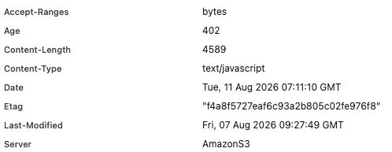
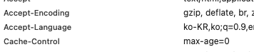
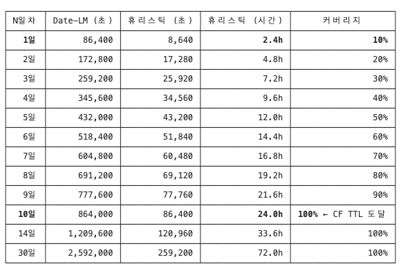
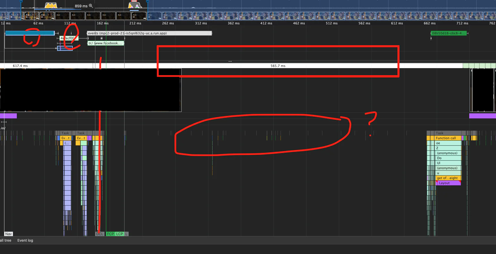
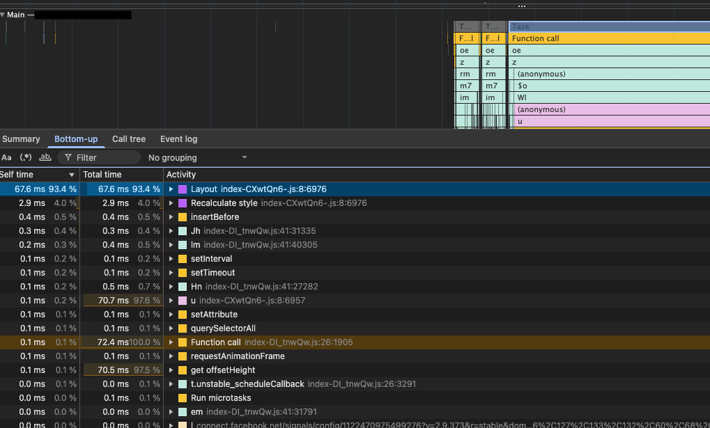
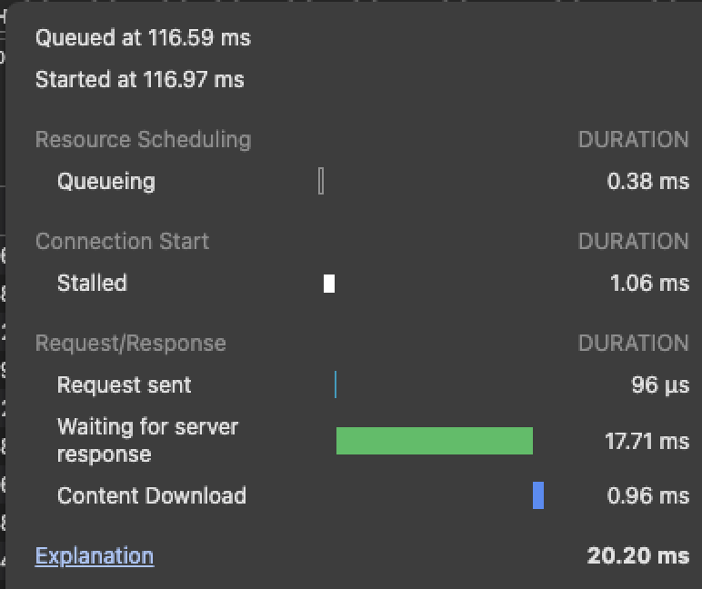
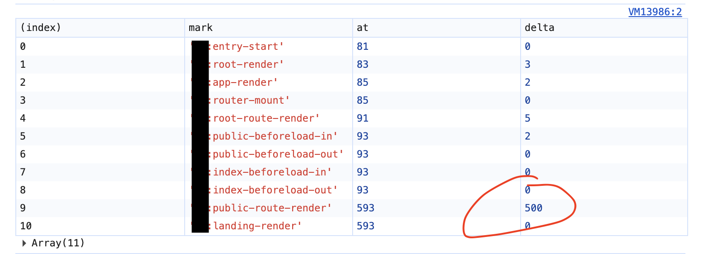
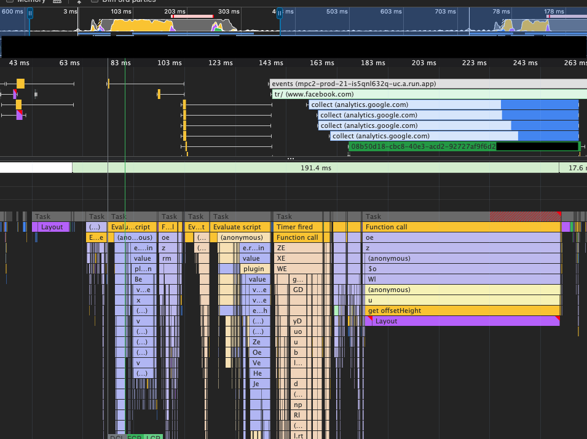

ai 덕분에 코드 생산에 미친듯한 속도로 달리다 보니  
나도 모르게 위임한 것들을 다시 살펴보느라 아주 오래간만에 재미있는 작업을 했습니다.

## 위임한 것 첫 번째, 캐시 헤더

나도 모르게 위임한 것 첫 번째는 캐시 헤더입니다.  
인터렉션 가능한 화면을 빠르게 마운트 시키기 위해 js청크 최적화 작업을 했습니다.  
근데 어제는 분명히 304 응답받는 걸 봤는데 오늘은 모든 청크가 disk cache를 사용해서 네트워크 왕복 지연이 발생하지 않고 있었습니다. 관찰하는 시간에 따라 캐시 사용상태가 달랐습니다.  
막연히 vite로 빌드하여 cache busting의 목적으로 정적파일에 해시값이 들어가서 배포된 파일은 유일하게 구분되어 캐싱된다고 알고 있었는데, 실제로 보니 간헐적으로 304와 캐시가 번갈아 적용되는 것 같았습니다.



헤더를 보니 위와 같은 상태였습니다.

각 항목에 대해 알아보니 Last Modified는 해당 정적파일이 마지막으로 수정된, 그러니까 immutable 한 정적파일을 빌드하는 현재 환경에서는 배포 날짜와 동일합니다. Date는 CloudFront 엣지로케이션이 마지막으로 s3에서 원본을 가져온 시간, Age는 엣지가 원본 받고 나서 경과된 시간이네요.

304 Not Modified를 받을 수 있는 이유는 S3가 붙여준 Etag와 Last Modified 덕분입니다. 둘 다 있으면 Etag를 사용합니다. 응답에 붙은 Etag를 캐시저장소에 저장하고 있다가 나중에 요청을 보낼 때 if-None-Match로 Etag값을 보냅니다.

그럼 서버에서는 캐시가 stale 하더라도 Etag를 비교해서 이 값이 같으면 캐시는 stale 하지만 파일은 그대로다라고 판단하여 304를 보내줍니다. 304는 네트워크에 바디가 비어있어서 매우 가볍습니다. 브라우저는 304를 받으면 캐시저장소에서 stale 한 내용을 꺼내서 다시 fresh 하게 사용합니다.

근데 위에서 보낸 네트워크는 disk cache를 사용하고 있었습니다. 뭘 보고 disk cache를 사용한 걸까요..?

### 정답은 HTTP 휴리스틱 캐시

정답은 [HTTP 휴리스틱 캐시](https://developer.mozilla.org/en-US/docs/Web/HTTP/Guides/Caching#heuristic_caching) 정책 때문입니다.

HTTP는 가능한 한 많은 것들을 캐시 하도록 설계되어 있다고 해요. Cache-Control 헤더가 없다고 하더라도 특정 조건에서는 휴리스틱 하게 캐싱을 합니다.

휴리스틱 캐시는 브라우저가 ((Date-Last Modified) / 10)을 그 응답의 수명(freshness lifetime)으로 잡습니다.

브라우저는 매번 이 수명과 응답의 현재 나이를 비교해서 수명 > 나이 일 경우에만 fresh로 판정하여 캐시를 활용합니다.

(이 설명은 크로미움 브라우저에 해당되는 내용입니다.)

한마디로 수정된 지 오래된 파일은 앞으로도 수정되지 않을 확률이 높다고 간주하는 겁니다. 휴리스틱 하죠.

저의 경우에는 Date - Last Modified가 4일이니까 대충 100시간이니 수명은 10시간입니다. 재검증 없이 fresh 하다고 판단할 수 있는 건 10시간 - age입니다. 그래서 지금은 disk cache로 보이는 건 수명이 10시간 남아서가 아니라 수명 10시간에서 엣지에서 먹은 나이를 빼고도 아직 여유가 있어서입니다.

어제 304였던 이유도 같습니다. 3일째라 수명이 7시간뿐인데, 거기서 age를 제외을때 훨씬 빨리 stale이 되었고, 그 뒤로는 Etag로 304를 받고 있었던 겁니다.  
이런 휴리스틱 한 캐시를 사용하는 상황에서 가장 문제 되는 상황은 SPA의 html파일이 휴리스틱 한 캐시 시간에 포함되어 새 배포를 했음에도 불구하고 유저가 html을 disk cache로 사용하는 상황입니다. 유저는 새 버전을 사용하지 못하고 과거의 js청크를 사용할 수 있습니다. s3에는 과거 청크가 모두 삭제된 상태라, 메인 리소스에 연결된 서브 청크들을 요청하는 순간 화면이 깨질 수 있습니다.

물론 이 경우는 아주 최악의 경우이고, 새로고침을 사용하면 chrome은 메인 리소스 요청 헤더에 cache-control max-age=0을 자동으로 부여하여 재검증합니다.



하지만 이것은 명백히 잘못된 상황이고 SPA로 작성된 웹은 index.html에 cache-control: no-cache를 사용하도록 권고됩니다.

[no-cache, no-store](https://httpwg.org/specs/rfc9111.html#cache-response-directive.no-cache)는 다릅니다. 링크 참고해 주세요.



휴리스틱 캐시 시간을 계산해 보면 10일째 되어야 휴리스틱 캐시만으로 100% 커버리지에 도달합니다.

하지만 절대 도달할리 없습니다. 하루에도 몇 번씩 배포를 하기 때문에 오히려 0일 차에 가깝고, 배포 한 날은 0시간에 가깝습니다.

즉 모든 청크는 304로 네트워크 왕복이 발생한다고 봐야 하는 상황입니다.

### cache-control 헤더와 캐시 버스팅

문제를 해결하기 위해 정적서버에서 응답에 cache-control 헤더를 넣어줘야 합니다.

이전에 캐시 무효화([cache-busting](https://developer.mozilla.org/en-US/docs/Web/HTTP/Guides/Caching#cache_busting)) 전략이 필요합니다.  
vite로 번들링 하는 경우 hash in filenames 방식으로 캐시 버스팅 전략을 쉽게 만들 수 있습니다.

쉽게 설명하자면 파일 내용에 따라 변경되는 유니크한 해시값을 파일이름이 넣어서 서버가 서빙하는 path를 유일하게 만드는 거죠.

해당 파일은 그럼 immutable 합니다.

그러니까 main.sdjh2e2.js같은 해시를 만들어서 파일내용이 변경될 때마다 유일한 파일을 만들어주면 1년 동안 fresh 한 immutable파일로 만들어도 상관없습니다.

권장 헤더는 Cache-Control: max-age=31536000, immutable입니다.

대신 index.html은 no-cache로 설정하여 304 응답을 받도록 해놓으면 새 배포가 되었을 때 max age 1년짜리 정적 파일들을 서빙해 줄 수 있습니다.

lcp, fcp까지 전부 최적화하고 js 압축하여 서빙하고 캐싱까지 했는데도 체감 성능이 여전히 안 좋았습니다.

제가 모르는 사이에 뭔가가 위임되고 있었습니다.

## 위임한 것 두 번째, 렌더

나도 모르게 위임한 것 두 번째는 렌더입니다.

모든 JS 청크가 캐시에 있었습니다. 그런데 메인 스레드는 500ms 동안 비어 있었습니다.



퍼포먼스 검사를 해봤습니다. 200ms~700ms까지 약 500ms의 공백이 있습니다. 메인스레드도 비어있습니다.

대체 메인스레드 비워져 있는데 왜 function call을 안 할까요?

js 청크는 100ms 부근에서 전부 캐시를 활용하여 로드가 완료되었습니다.

그럼 리액트 render 자체가 호출이 안되는 걸까요?

ga 같은 서드파티가 문제일까요?

가장 눈에 띄는 ga 이벤트 관련 도메인을 전부 제거하고 테스트를 해봐도 여전히 메인스레드를 놀리고 있습니다.

서드파티가 가져오는 스크립트 문제는 아닌 것 같습니다. 그럼 리액트 자체가 메인청크 다운로드 후에 호출이 늦는 걸까요?

performance.mark로 측정해 봤으나 80ms정도에서 호출이 되었습니다.



알 수 없는 공백 후에 바로 실행되는 task를 보니 index-CXwtQn6.js임을 알 수 있습니다.



청크 다운로드 문제는 아님을 알 수 있습니다. 다른 원인이 딜레이 시키고 있습니다.

그럼 서드파티 문제도 아니고 청크 다운로드 문제도 아니고, 리액트 렌더 문제도 아니면 어디가 문제일지 정말 감이 안 왔습니다.

알아낸 구간(청크 다운로드부터 첫 랜딩페이지 js 실행)의 길이가 그리 크지 않았습니다.

main.js부터 랜딩페이지 route까지 실제로 찍히는 실행시점만 눈으로 확인해 보면 됩니다.



main.js, __root.js, route.js, index.js를 순차적으로 찍어보니 public route에서 500~501의 딜레이가 걸리고 있는 것을 찾았습니다.

저 딜레이가 환경에 따라 달라지지 않고 계속 500~501 정도? 혹은 499 정도가 찍히는 것을 보고 tanstack-router 라이브러리에 settimeout 이 걸려있음을 의심했습니다.

### tanstack-router의 defaultPendingMinMs

ai로 소스코드를 분석해 본 결과. 마이너 구버전에서 pending ui가 없는데도 불구하고 defaultPendingMinMs를 딜레이 시키는 이슈가 있음을 발견했습니다. 이슈를 찾아보니 이슈로도 보고가 되었네요.

[https://github.com/TanStack/router/issues/1646](https://github.com/TanStack/router/issues/1646)

내용을 분석해 보니 tanstack-router에서 loader기능을 제공합니다.

이 목적은 SPA에서 네트워크를 사용할 때 네트워크 워터폴이 컴포넌트 렌더링 워터폴과 섞여서 전체적으로 느려지는 것을 방지하기 위해

렌더와 병렬로 진행하는 loader기능을 제공합니다. loader-first 전략은 데이터 페치를 화면이 그려지기 전에 병렬로 해서 완성된 화면을 하니번에 보여주자는 전략입니다. 로딩 중인 route는 pending 상태가 되고(pending은 loader뿐만 아니라 beforeLoad, preload, lazyFn까지 포함), 이때 보여주는 화면이 pending ui가 됩니다. 병렬요청은 보통 1초까지 안 가고 끝날 것으로 예상하고 일정 시간 동안 stale 한 화면을 보여주고, 새 화면으로 한 번에 이동시켜서 완성된 화면을 보여주는 방식입니다. 여기서 1초가 바로 defaultPendingMs옵션입니다. 그리고 만약 1초를 기다린다고 할 때 1.05초 만에 병렬요청이 완료된 화면이라면 50ms만 pending ui가 보이게 되겠죠?

pending ui가 50ms만 잠깐 보이게 되면 사용자는 이게 pending ui인지, 그냥 깜빡이는건지, 아니면 고장 난 건지 인지하지 못합니다.

당연히 버그가 있다고 생각하거나 랙걸린다 라고 생각하겠죠.

그래서 이왕 로딩을 보여줄거면 500ms정도 보여줘라 라는 의도가 있습니다. 이것이 defaultPendingMinMs옵션입니다.

defaultPendingMs는 1초이고, defaultPendingMinMs는 500ms로 설정이 되어 있습니다.

근데 문제는 pending ui를 사용할 의도가 아님에도 불구하고 첫 화면 로딩에 defaultPendingMinMs가 적용되는 버그가 있는 것이었어요.

소스코드를 분석해 보니 defaultPendingMinMs를 기다려야 하는지 판단하는 로직이 pending ui의 유무와 상관없이 동작하고 있었습니다. 우리 서비스는 code splitting 되어있어 lazyFn이 true가 되어 pending상태로 분류되었고, pending ui가 없는데도 첫 로딩에 500ms를 딜레이 시키고 있었어요. 이 동작은 설계 방향과 일치하지 않는 잘못된 버그이고, 최신 마이너 버전을 확인하니 문제가 전부 해결되어있는 것을 확인할 수 있었습니다.

```typescript
defaultPendingMinMs: 0
```

을 설정해도 문제없이 동작하지만 이것은 유용한 옵션이므로 pending ui를 정상적으로 사용하는 때에는 해당 옵션을 오버라이드 해줘야 하기 때문에 default 옵션을 건들지 않고 라이브러리 업데이트로 진행했습니다.



해결 후 랜딩페이지 Task가 즉시 실행됨을 확인할 수 있었습니다.

## 판단력까지 위임해서는 안 된다

lighthouse 점수만 올려놓고 성능에 문제없다고 하는 것 또한 나도 모르게 판단력을 위임한 것이라고 생각합니다.

직접 써보고 사용자로서 불편한지? 느린지 눈으로, 손가락으로 느껴봐야만 알 수 있는 것들이 있어요.

아무리 AI에게 모든 것을 위임하고 자동화하는 시대라고 하지만

문제를 문제라고 생각하는 판단력까지 위임해서는 안될 겁니다.

문제 해결이 아주 값싸진 시대에 문제를 정의하고 찾아내는 사람이 아직은 더 필요하지 않을까요?
